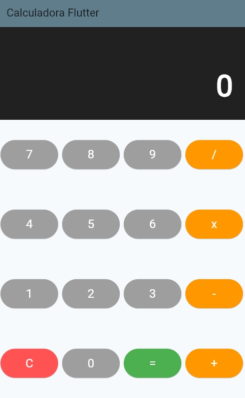

# Calculadora em Flutter (Componentizada)

**Estudante:** Eduardo Alan dos Santos  
**RA:** 23074991-2


## Descrição da Aplicação
Este projeto é um aplicativo de calculadora desenvolvido com o framework Flutter. O objetivo principal foi aplicar conceitos de desenvolvimento de interfaces modernas utilizando a **componentização de widgets**.

### Funcionalidades em Destaque
* **Operações Básicas:** Adição, subtração, multiplicação e divisão.
* **Componentização:** Interface totalmente separada em widgets reutilizáveis (`Botao` e `Display`).
* **Histórico de Operação:** Exibição da equação completa (ex: `10 x 3`) em uma camada com opacidade no visor, melhorando a experiência do utilizador (UX).
* **Reset Inteligente:** Ao finalizar um cálculo com `=`, a digitação de um novo número inicia automaticamente uma nova operação, reproduzindo o comportamento fiel de calculadoras físicas reais.
* **Prevenção de Erros:** Tratamento para divisões por zero com mensagem de erro no display.

## Estrutura de Componentes
A interface foi organizada na pasta `lib/widgets/`:

* **`Botao` (`botao.dart`):** Widget reutilizável que recebe `texto`, `cor` e uma função `aoClicar`. Utiliza o widget `Expanded` para se adaptar dinamicamente à tela.
* **`Display` (`display.dart`):** Widget focado na exibição de dados. Utiliza uma `Column` para empilhar o histórico da operação (com menor destaque) e o valor principal digitado.
* **`Calculadora` (`calculadora.dart`):** É a tela principal (StatefulWidget) que une o `Display` e os `Botoes`. Concentra toda a lógica matemática, o gerenciamento de estado (`setState`) e as *flags* de controle de fluxo.

## Instruções para Execução

Para rodar este aplicativo localmente:

1.  Certifique-se de ter o [Flutter instalado](https://docs.flutter.dev/get-started/install).

2.  Clone este repositório e o abra preferencialmente no VS Code:
    ```bash
    git clone https://github.com/edsantos-dev/estudos-mobile.git
    ```
3.  Baixe as dependências do projeto:
    ```bash
    flutter pub get
    ```
4.  Execute o aplicativo pelo terminal (ou utilizando o `launch.json` configurado no VS Code pressionando `F5` ou no Run and Debug `Trabalho 3: Calculadora Flutter`):
    ```bash
    flutter run .\lib\trabalho_3\main_t3.dart
    ```

## Interface da Aplicação

<p align="center">
  
</p>